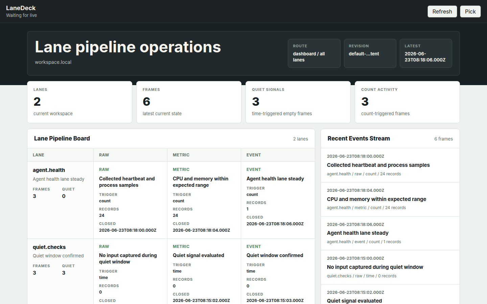

<h1 align="center">LaneDeck</h1>

<p align="center">
  
</p>

Personal observability deck for local agents, lane pipelines, and AI-editable dashboards.

LaneDeck is a monorepo with a Rust local agent, a Cloudflare center service, a Tauri shell, and editable React content.

## What It Does

LaneDeck turns local machine and workflow signals into a personal operations
dashboard.

- Local agents collect source data, run lane pipelines, spool results, upload
  ingest batches, and keep an outbound WSS control channel to the center.
- Each lane always runs through `raw collection -> metric/process -> event`.
  Count-triggered frames and time-triggered quiet-signal frames move through the
  same pipeline.
- The Cloudflare center stores structured history in D1, file-shaped content and
  artifacts in R2, coordinates workspaces through Durable Objects, and exposes
  ingest, query, content, live-update, and AI mutation APIs.
- The shell is the stable Tauri/React host. It loads dashboard content in an
  iframe, watches browser live updates, refreshes current content revisions, and
  hosts picker mode.
- Content is mutable React dashboard data. It reads center query APIs, renders
  logs, metrics, events, current state, lane boards, and custom pages, and
  reports source-level pick identifiers back to the shell.
- AI mutation APIs write mutable content source, lane settings, and build
  requests. Query APIs read current state and history.

## Cloudflare Center

LaneDeck's deploy target is the Cloudflare center Worker. The Worker uses:

- Worker: `lanedeck-center`
- Durable Object: `WORKSPACE_COORDINATOR`
- D1 database: `lanedeck`
- R2 bucket: `lanedeck`
- Worker Static Assets for the browser shell
- Cloudflare Access for `/shell`

Cloudflare R2 must be enabled on the account before deploy. Use a Wrangler login
session or a `CLOUDFLARE_API_TOKEN` with Workers, D1, R2, and Workers Scripts
secret permissions.

Deploy with:

```bash
export LANEDECK_AGENT_TOKEN=...
export LANEDECK_AI_MUTATION_TOKEN=...
export LANEDECK_READ_TOKEN=...
export LANEDECK_CENTER_URL=https://lanedeck-center.<subdomain>.workers.dev

corepack pnpm run preflight:center
corepack pnpm run deploy:center
corepack pnpm run verify:center
```

`preflight:center` builds the shell assets, checks Wrangler authentication,
checks the configured D1 database, checks R2 availability, and runs a strict
Worker dry run.

`deploy:center` builds the shell assets, writes the three LaneDeck Worker
secrets, creates the `lanedeck` R2 bucket when the bucket is missing, and deploys
the Worker.

`verify:center` writes a `deploy-health-*` workspace to D1 and R2, applies a
content mutation, completes a content build, and reads the promoted content
asset back through the deployed Worker.

## Use LaneDeck

The browser shell is served by the center Worker through Workers Static Assets.
Open `https://lanedeck-center.<subdomain>.workers.dev/`; the root route
redirects to the Cloudflare Access-protected `/shell` route. The Worker
validates the Access JWT and establishes the HttpOnly read session cookie.
The read token stays inside the Worker-managed session. The deployed shell loads
iframe content through the Worker route
`/content-by-workspace/{workspaceId}/{revision}/{assetPath}` and connects to
`/ws/browser` for live updates.

Use the shell controls:

- `Refresh` reloads the current content descriptor and iframe content.
- `Pick` arms picker mode. Selecting registered content copies its source-level
  pick id for AI mutation workflows.

Use the public HTTP APIs with the deployed center URL:

```bash
curl "$LANEDECK_CENTER_URL/api/query" \
  -H "authorization: Bearer $LANEDECK_READ_TOKEN" \
  -H "content-type: application/json" \
  -d '{"workspaceId":"workspace.local","query":"current_state","params":{}}'
```

```bash
curl "$LANEDECK_CENTER_URL/api/ai/mutation" \
  -H "authorization: Bearer $LANEDECK_AI_MUTATION_TOKEN" \
  -H "content-type: application/json" \
  -d '{"workspaceId":"workspace.local","mutation":"patch_content","payload":{"path":"dashboards/home.tsx","source":"export default function Dashboard() { return null; }"}}'
```

Agent ingest uses `POST /api/ingest` with
`Authorization: Bearer $LANEDECK_AGENT_TOKEN`. Agent control connects to
`GET /ws/agent?workspaceId=<id>&machineId=<id>` with the same agent bearer
token.

For local frontend development against a running local center:

```bash
corepack pnpm --filter @lanedeck/content dev --host 127.0.0.1 --port 5173
```

```bash
VITE_LANEDECK_CENTER_URL=http://localhost:8787 \
VITE_LANEDECK_CONTENT_BASE_URL=http://127.0.0.1:5173/ \
VITE_LANEDECK_WORKSPACE_ID=workspace.local \
corepack pnpm --filter @lanedeck/shell dev --host 127.0.0.1
```

## Validate

```bash
corepack pnpm run check
corepack pnpm run test
cargo check --workspace
cargo test --workspace
```

Full-system e2e composes the local agent, center, shell, content, live updates,
and artifact writer. See `e2e/README.md` for the required `LANEDECK_E2E_*`
environment.

## Workspace

- `packages/protocol`: shared JSON protocol, TypeScript types, and Rust DTOs.
- `packages/lane-engine`: Rust lane pipeline engine.
- `packages/agent-runtime`: Rust local agent runtime, source runners, spool,
  ingest upload, and WSS control.
- `packages/center-worker`: Cloudflare Worker, Durable Object, D1, R2, query
  API, ingest API, content API, live WSS, and AI mutation API.
- `packages/shell`: Tauri v2 + React shell, iframe host, picker, and WSS live
  updates.
- `packages/content`: React dashboard content loaded by the shell.

Use `corepack pnpm` for TypeScript workspace commands and `cargo` for Rust
workspace commands.
